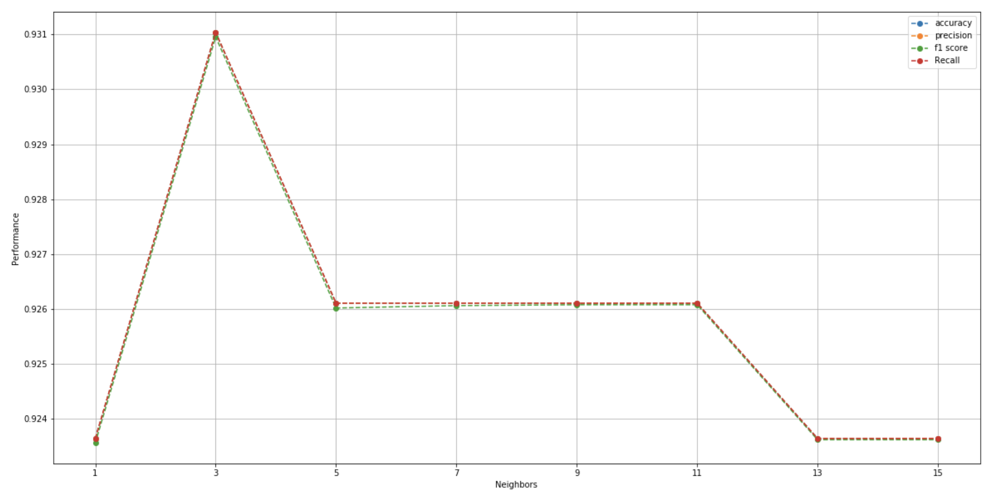
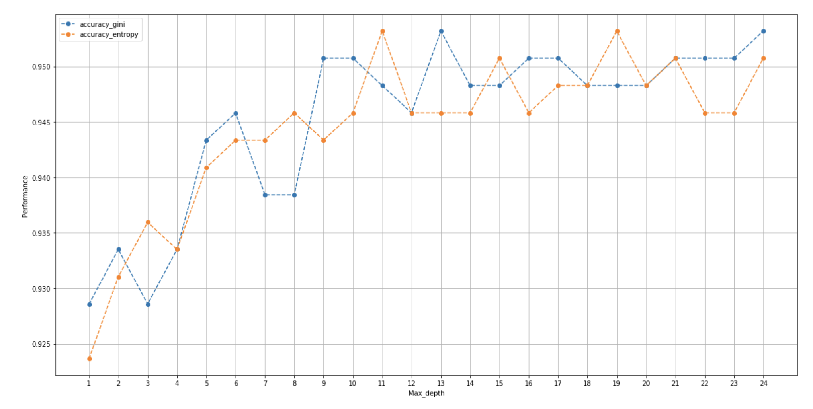
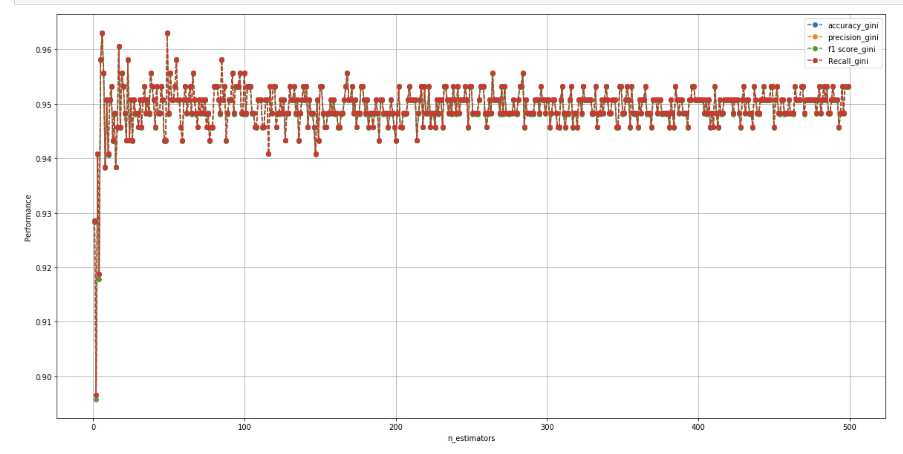
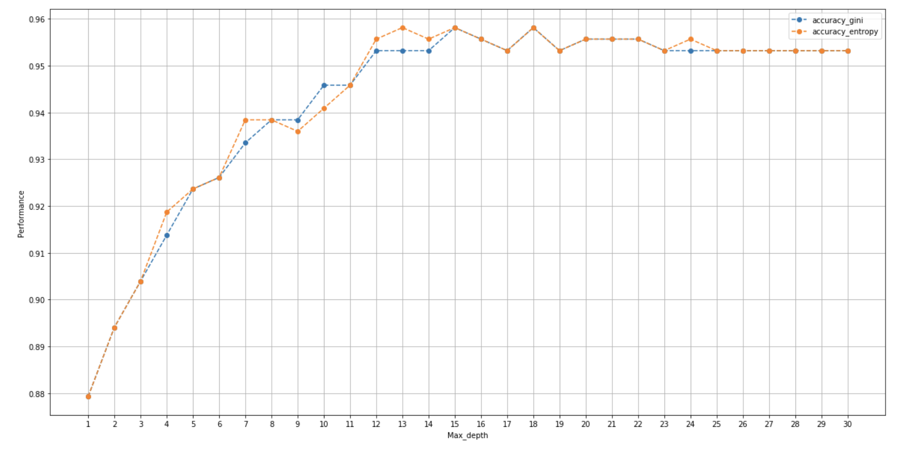
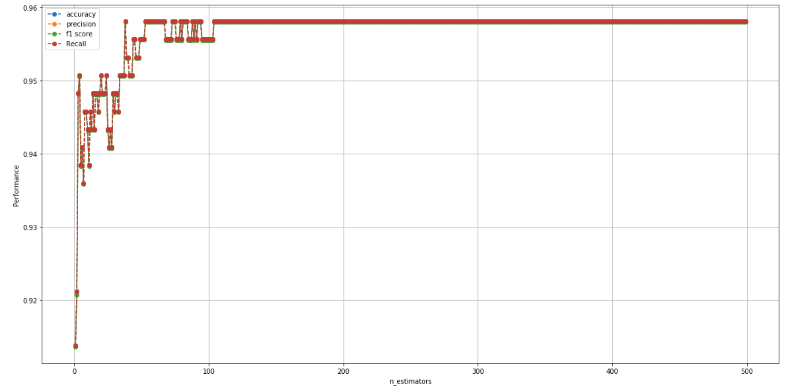

# Covid-19-project
Update(Aug 6 2020)
---------------
1. Decision interpretation(Contains in Covid_entropy.pdf and Covid_gini.pdf)
2. Parameter tuning(KNN,DT,RF,NB,ET)
3. Feature importance(By Extra Tree Classifier)

KNN
----
The performance graph on KNN with # of neighbors as variable

RF
---
comparison between gini and entropy with the # of max depth as variable

According above graph, the max accuracy produced by gini and entropy are the same, hence max_depth = 13, criterion = 'gini' are choosed for the n_estimator comparision.

The best performance(Accuracy) in RF is 96.3% with n_estimator = 5

ET(Extra tree classifier)
-------------

max_depth=15, criterion = 'gini'

Feature importance
--------------

Update(Jul 31 2020)
--------

1. Rebuild whois search model, current non-empty rate of unlabel_data' 'start_date' is 100%.
2. Construct the sample data with confirmed label and construct initial algorithms on the sample dataset.
3. Removed feature 'special_mark'.
4. data_Confirmed_whitelist_final_version3.csv and data_confirmed_CovidURL_final_version3.csv are sample data with label
5. Algorithm tuning.ipynb contains current algorithms.

Sample data structure
---------

| Name | Size | # of Features |
| ----- | ----- | ------- |
| white_list_final | 680 | 17 |
| confirmed_maclious_final | 548 | 17 |

Algorithms performance
--------

| Name | Accuracy | precision | recall | F1 score | Configuration | 
| ----- | ----- | ------- | ------ | ------ | ----- |
| DT | 93.1% | 93.1% | 93.1% | 93.0% | criterion = gini, max depth = None,max max features=auto |
| KNN | 92.3% | 92.3% | 92.4% | 92.4% | n neighbors = 14, weights = distance,p=2 |
| RF | 94.6% | 94.6% | 94.6% | 94.6% |n estimators = 100, max depth = None, max features=auto |
| NB | 79.9% | 79.9% | 79.8% | 79.9% | - |
| MLP | 86.9% | 86.9% | 86.9% | 86.9% |batch_size = 100,epochs = 30,optimizer = SGD,lr=0.0001,loss='binary_crossentropy'|

Update(Jul 25 2020)
--------
1. data_confirmed_CovidURL_final_version2.csv. data_Confirmed_whitelist_final_version2.csv. data_unlabled_data_final_version2.csv remove the columns ['end_date','blocked url','site age(days)','Shortening_service'], 
2. By relocating the IP address of the domain, querying the creation date of the IP address supplements the missing value in the previous start date。
3. Add new feature 'Created on 2020'.

| Name | Non_missing_value_rate(start_date)before | Non_missing_value_rate(start_date)after |
|------ | ----| ------|
| unlabeled data | 38% | 85%|
| Confirmed Covid19 related maclious data | 55% |79% |
| white list data | 100% | 100% |

Initial stage
--------------
1. Confirmed_whitelist_final_version.csv contains all white domain list with its feature.
2. confirmed_CovidURL_final_version.csv contains all maclious domain list with its feature.
3. unlabled_data_final_version.csv contains all unlabeled domain list with its feature.
4. phish_tank_final_version.csv contains all malicious urls from Phishtank with its feature
5. Data_cleaning contains part of the data preprocessing steps and data cleaning on the faature with null value.
6. Covid_unified_version.ipynb produces the inital featrue extraction from the raw data according to Professor Sopie's thesis and initial DBSCAN algorithm.
7. Phish_tank preprocess.ipynb contains new feature extraction opteration and phish tank data preprocessing steps.
8. Algorithm construction.ipynb contains current one-class SVM and DBSCAN algorithms

Data information
---------
| Name | Size | features |
|------ | ----| ------|
| unlabeled data | 229488 rows | 21|
| Phish tank data | 98251 rows | 21 |
| Confirmed Covid19 related maclious data | 394 rows |21 |
| white list data | 98 rows | 21|

Feature description
--------------------
| Feature | Data type  |  Description |
| ------- | --- | -----------|
| Unified_url | String | URLs
| Reachable_URL | categorical | Check whether the browser can reach to the url|
| Way_back_archived | categorical | Check whether the website is archived on Wayback Machine |
| Freenom_top_level_domain | categorical | Freenom top level domain (TLD) |
| Previous_malicious_top_level_domain_TLD | categorical | Previous malicious top level domain (TLD)|
| Name_length | ordinal | Domain Name length |
| Wrong_spell_List | categorical | Check whether the domain contain the wrong spell words|
| Longest_word_ratio | ordinal | Ratio of the longest English word |
| Special_mark | categorical | Containing “-” |
| sub_domain| ordinal | Number of subdomains |
| Shortening_service | ordinal | whether the url implement shortening service|
| Contain_Weried_number_combination | categorical | Presence of IP address in the URL |
| levenshtein_distance | ordinal | Mean levenshtein edit distance to confirmed phishing website |
| Alexa_rank | ordinal | Check the Alexa rank of the domain |
| Status_code | categorical | Check the domain status code by calling Amazon web service |
| start_date | ordinal | The documented record of the website creation date |
| end_date | ordinal | The documented record of the website expired date |
| site_age(days) | ordinal | Total time of website existence |
| wildcard_subdomain | categorical | This feature checks whether the domain is registered to accept all subdomains |
| Redirect_URL | categorical | This feature checks whether access to the domain redirectsto a different domain. |
| Blocked_url | categorical |This feature checks whether access to the domain returns error|

Inital feature transformation and data cleaning
------------------------------
1. Convert Alexa_rank from ordinal to binary data format. 1 means the domain has record on Alexa rank, 0 means the opposite.
2. Implement datawig Deep learning imputer model on start_date and end_date to impute missing values. 
3. Since the missing values in start_date and end_date in unlabeled_final is more than 50%, using features correlation table to extract the most relevant features corresponding to start_date and end_date can be much more accurate than the mean, median or most frequent imputation methods.
4. Normalize levenshtein_distance and site_age(days)
Feature correlation socre table
------------

                                      
                                                  
                                                    
Inital One-class SVM classification and parameter tuning process
------------------------
| Parameter | Value |
| --------- | -----|
| Kernel | poly |
| gamma | scale |

Discussion
----------
In the stage, Phish_tank data is regarded as negative cluster where one-class SVM model is trained on, degree of SVM model is tuned during the initial process. The rate of positive label(legitimate url) is used as performance on the observation process to find out how the level of degree would affect model performance.

Inital DBSCAN clustering and parameter tuning process
------------------------
| Parameter | Value |
| --------- | -----|
| eps | 1.5 |
| min_samples | 30 |
| metric | cosine |
| metric_params | None|
| algorithm | auto |
| leaf_size | 30|

