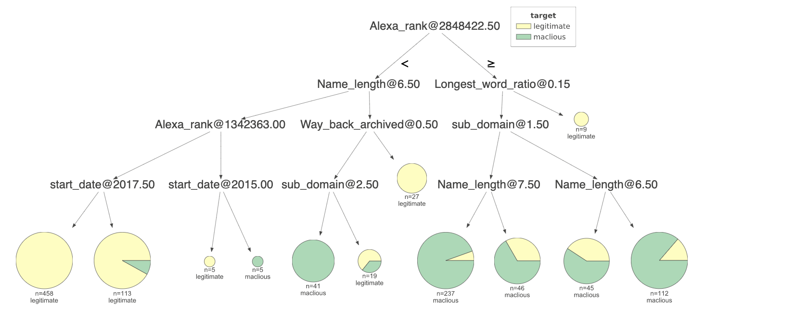

# Covid-19-project

Update(Aug 24 2020)
------------------
Note: The different best performance in the following algorithms might be result from different parameters which would be specially illustrate in the following description.

| Name | Best_Accuracy | Best_precision | Best_recall | Best_F1 score | Best_mean cross val score |
| ----- | ----- | ------- | ------ | ------ | ----- |
| DT | 91.1% | 89.6% | 93.5% | 89.6% | 91.5% |
| KNN | 89.7% | 89.6% | 86.3% | 87.5% | 87.0% |
| RF | 92.1% | 89.7% | 93.5% | 90.1% | 91.6% |
| NB | 85.1% | 84.6% | 78.6% | 81.5% | 87.7% | 
| ET | 91.9% | 90.4% | 92.2% | 90.3% | 91.6% |
| MLP | 85.1% | 84.6% | 78.6% | 81.5% | --- |

Feature importance
--------------

**Feature ranking**
|Feature code| Feature name|
| ------- | ------ |
|feature 8 (0.363817) |Contain_Weried_number_combination|
|feature 0 (0.163590) |Created on 2020|
|feature 5 (0.104504) |Wrong_spell_List|
|feature 3 (0.097368) |Previous_malicious_top_level_domain_TLD|
|feature 9 (0.093536) |Alexa_rank|
|feature 6 (0.073895) |Longest_word_ratio|
|feature 12 (0.058321) |Redirect_URL|
|feature 10 (0.032749) |start_date|
|feature 2 (0.005586) |Freenom_top_level_domain|
|feature 7 (0.003409) |sub_domain|
|feature 1 (0.002890) |Way_back_archived|
|feature 4 (0.000318) |Name_length|
|feature 11 (0.000018) |wildcard_subdomain|

Decision Tree
-------------
**Performace graph on the correlation between max_depth and performance:**

best depth for accuracy: 4 accuracy: 0.9051490514905149
best depth for precision: 7 precision: 0.8666666666666667
best depth for f1_score: 4 f1_score: 0.889589905362776
best depth for recall: 3 recall: 0.935064935064935
best depth for cross_val: 4 recall: 0.9088481338481339

**Performace graph on the correlation between min_leaf_number and performance:**

minimum sample for accuracy: 6 accuracy: 0.9105691056910569
minimum sample for precision: 6 precision: 0.8666666666666667
minimum sample for f1_score: 6 f1_score: 0.896551724137931
minimum sample for recall: 17 recall: 0.9415584415584416
minimum sample for Cross_avl: 2 Cross_val: 0.9106338481338481

**Best DT visualize**

KNN
-----
Parameter(weights='distance',p=2)
**Performace graph on the correlation between Number_of_K and performance:**

best K for accuracy: 13 accuracy: 0.8970189701897019
best K for precision: 3 precision: 0.8958333333333334
best K for f1_score: 13 f1_score: 0.875
best K for recall: 13 recall: 0.8636363636363636
best K for cross_val: 13 cross_val: 0.8702220077220076 

RF
---
**Performace graph on the correlation between max_depth and performance:**

best depth for accuracy: 5 accuracy: 0.9105691056910569
best depth for precision: 17 precision: 0.891156462585034
best depth for f1_score: 5 f1_score: 0.897196261682243
best depth for recall: 3 recall: 0.935064935064935
best depth for Cross_val: 9 cross_val: 0.9133043758043758

**Performace graph on the correlation between n_estimators and performance:**

best estimator for accuracy: 19 accuracy: 0.9214092140921409
best estimator for precision: 2 precision: 0.8976377952755905
best estimator for f1_score: 19 f1_score: 0.9090909090909091
best estimator for recall: 19 recall: 0.9415584415584416
best estimator for Cross_val: 271 Cross_val: 0.915990990990991

**Performace graph on the correlation between criterion and performance:**

ET
---
**Performace graph on the correlation between max_depth and performance:**

best depth for accuracy: 14 accuracy: 0.9186991869918699
best depth for precision: 24 precision: 0.9041095890410958
best depth for f1_score: 14 f1_score: 0.9038461538461539
best depth for recall: 7 recall: 0.922077922077922
best depth for Cross_val: 13 Cross score: 0.9087998712998713 

**Performace graph on the correlation between n_estimators and performance:**

best estimator for accuracy: 3 accuracy: 0.9159891598915989
best estimator for precision: 238 precision: 0.89171974522293
best estimator for f1_score: 3 f1_score: 0.9009584664536741
best estimator for recall: 3 recall: 0.9155844155844156
best estimator for Cross_val: 57 cross val: 0.9159829472329472  

**Performace graph on the correlation between criterion and performance:**

MLP
-----

**Performace graph on the correlation between batch_size and performance:**
best batch_size for accuracy: 19 accuracy: 0.896551724137931  
best batch_size for precision: 23 precision: 0.8936170212765957  
best batch_size for f1_score: 19 f1_score: 0.8975609756097561  
best batch_size for recall: 43 recall: 0.9644670050761421  

Update(Jul 25 2020)
--------
1. data_confirmed_CovidURL_final_version2.csv. data_Confirmed_whitelist_final_version2.csv. data_unlabled_data_final_version2.csv remove the columns ['end_date','blocked url','site age(days)','Shortening_service'], 
2. By relocating the IP address of the domain, querying the creation date of the IP address supplements the missing value in the previous start date。
3. Add new feature 'Created on 2020'.

| Name | Non_missing_value_rate(start_date)before | Non_missing_value_rate(start_date)after |
|------ | ----| ------|
| unlabeled data | 38% | 85%|
| Confirmed Covid19 related maclious data | 55% |79% |
| white list data | 100% | 100% |

Initial stage
--------------
1. Confirmed_whitelist_final_version.csv contains all white domain list with its feature.
2. confirmed_CovidURL_final_version.csv contains all maclious domain list with its feature.
3. unlabled_data_final_version.csv contains all unlabeled domain list with its feature.
4. phish_tank_final_version.csv contains all malicious urls from Phishtank with its feature
5. Data_cleaning contains part of the data preprocessing steps and data cleaning on the faature with null value.
6. Covid_unified_version.ipynb produces the inital featrue extraction from the raw data according to Professor Sopie's thesis and initial DBSCAN algorithm.
7. Phish_tank preprocess.ipynb contains new feature extraction opteration and phish tank data preprocessing steps.
8. Algorithm construction.ipynb contains current one-class SVM and DBSCAN algorithms

Data information
---------
| Name | Size | features |
|------ | ----| ------|
| unlabeled data | 229488 rows | 21|
| Phish tank data | 98251 rows | 21 |
| Confirmed Covid19 related maclious data | 394 rows |21 |
| white list data | 98 rows | 21|

Feature description
--------------------
| Feature | Data type  |  Description |
| ------- | --- | -----------|
| Unified_url | String | URLs
| Reachable_URL | categorical | Check whether the browser can reach to the url|
| Way_back_archived | categorical | Check whether the website is archived on Wayback Machine |
| Freenom_top_level_domain | categorical | Freenom top level domain (TLD) |
| Previous_malicious_top_level_domain_TLD | categorical | Previous malicious top level domain (TLD)|
| Name_length | ordinal | Domain Name length |
| Wrong_spell_List | categorical | Check whether the domain contain the wrong spell words|
| Longest_word_ratio | ordinal | Ratio of the longest English word |
| Special_mark | categorical | Containing “-” |
| sub_domain| ordinal | Number of subdomains |
| Shortening_service | ordinal | whether the url implement shortening service|
| Contain_Weried_number_combination | categorical | Presence of IP address in the URL |
| levenshtein_distance | ordinal | Mean levenshtein edit distance to confirmed phishing website |
| Alexa_rank | ordinal | Check the Alexa rank of the domain |
| Status_code | categorical | Check the domain status code by calling Amazon web service |
| start_date | ordinal | The documented record of the website creation date |
| end_date | ordinal | The documented record of the website expired date |
| site_age(days) | ordinal | Total time of website existence |
| wildcard_subdomain | categorical | This feature checks whether the domain is registered to accept all subdomains |
| Redirect_URL | categorical | This feature checks whether access to the domain redirectsto a different domain. |
| Blocked_url | categorical |This feature checks whether access to the domain returns error|

Inital feature transformation and data cleaning
------------------------------
1. Convert Alexa_rank from ordinal to binary data format. 1 means the domain has record on Alexa rank, 0 means the opposite.
2. Implement datawig Deep learning imputer model on start_date and end_date to impute missing values. 
3. Since the missing values in start_date and end_date in unlabeled_final is more than 50%, using features correlation table to extract the most relevant features corresponding to start_date and end_date can be much more accurate than the mean, median or most frequent imputation methods.
4. Normalize levenshtein_distance and site_age(days)
Feature correlation socre table
------------

                                      
                                                  

